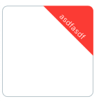

# ui_flutter

# UI 1



[Go to code](#code-1)

# UI 2


[Go to code](#code-2)

# UI 3


[Go to code](#code-3)

# UI 3


[Go to code](#code-4)


# Code

### Code 1
#### USE

```dart
Card(
  shape: RoundedCustomRectangleBorder(
      borderRadius: BorderRadius.circular(10),
      side: const BorderSide(color: Colors.red)),
  child: const SizedBox(
    width: 100,
    height: 100,
  ),
)
```

```dart
class RoundedCustomRectangleBorder extends OutlinedBorder {
  const RoundedCustomRectangleBorder({
    BorderSide side = BorderSide.none,
    this.borderRadius = BorderRadius.zero,
  }) : super(side: side);
  final BorderRadiusGeometry borderRadius;
  @override
  EdgeInsetsGeometry get dimensions {
    return EdgeInsets.all(side.width);
  }
  @override
  ShapeBorder scale(double t) {
    return RoundedRectangleBorder(
      side: side.scale(t),
      borderRadius: borderRadius * t,
    );
  }
  @override
  ShapeBorder? lerpFrom(ShapeBorder? a, double t) {
    if (a is RoundedRectangleBorder) {
      return RoundedRectangleBorder(
        side: BorderSide.lerp(a.side, side, t),
        borderRadius:
            BorderRadiusGeometry.lerp(a.borderRadius, borderRadius, t)!,
      );
    }
    if (a is CircleBorder) {
      return _RoundedRectangleCustomToCircleBorder(
        side: BorderSide.lerp(a.side, side, t),
        borderRadius: borderRadius,
        cirCleNess: 1.0 - t,
      );
    }
    return super.lerpFrom(a, t);
  }

  @override
  ShapeBorder? lerpTo(ShapeBorder? b, double t) {
    if (b is RoundedRectangleBorder) {
      return RoundedRectangleBorder(
        side: BorderSide.lerp(side, b.side, t),
        borderRadius:
            BorderRadiusGeometry.lerp(borderRadius, b.borderRadius, t)!,
      );
    }
    if (b is CircleBorder) {
      return _RoundedRectangleCustomToCircleBorder(
        side: BorderSide.lerp(side, b.side, t),
        borderRadius: borderRadius,
        cirCleNess: t,
      );
    }
    return super.lerpTo(b, t);
  }
  @override
  RoundedRectangleBorder copyWith(
      {BorderSide? side, BorderRadiusGeometry? borderRadius}) {
    return RoundedRectangleBorder(
      side: side ?? this.side,
      borderRadius: borderRadius ?? this.borderRadius,
    );
  }

  @override
  Path getInnerPath(Rect rect, {TextDirection? textDirection}) {
    return Path()
      ..addRRect(borderRadius
          .resolve(textDirection)
          .toRRect(rect)
          .deflate(side.width));
  }

  @override
  Path getOuterPath(Rect rect, {TextDirection? textDirection}) {
    return Path()..addRRect(borderRadius.resolve(textDirection).toRRect(rect));
  }

  @override
  void paint(Canvas canvas, Rect rect, {TextDirection? textDirection}) {
    switch (side.style) {
      case BorderStyle.none:
        break;
      case BorderStyle.solid:
        final double width = side.width;
        if (width == 0.0) {
          canvas.drawRRect(borderRadius.resolve(textDirection).toRRect(rect),
              side.toPaint());
        } else {
          final RRect outer = borderRadius.resolve(textDirection).toRRect(rect);
          final RRect inner = outer.deflate(width);
          final Paint paint = Paint()..color = side.color;
          final Paint paint2 = Paint()..color = Colors.white;

          canvas.drawDRRect(outer, inner, paint);
          canvas.drawPath(
              Path()..addPath(getTrianglePath(40, 40), const Offset(-30, -19)),
              paint);
          canvas.drawPath(
              Path()
                ..addPath(getTickPath(const Size(35, 35)), const Offset(79, 0)),
              paint2);
        }
    }
  }

  Path getTrianglePath(double x, double y) {
    return Path()
      ..moveTo(x * 2.240499, y * 0.4641165)
      ..lineTo(x * 3.039413, y * 0.4641165)
      ..arcToPoint(Offset(x * 3.240499, y * 0.6652069),
          radius: Radius.elliptical(x * 0.2010859, y * 0.2010904))
      ..lineTo(x * 3.240499, y * 1.464117)
      ..close();
  }

  Path getTickPath(Size size) {
    final Path path_0 = Path();
    path_0.moveTo(size.width * 0.1513658, size.height * 0.5394244);
    path_0.lineTo(size.width * 0.006621293, size.height * 0.3682648);
    path_0.arcToPoint(Offset(size.width * 0.006621293, size.height * 0.3311515),
        radius: Radius.elliptical(
            size.width * 0.02537649, size.height * 0.02780121));
    path_0.lineTo(size.width * 0.03812633, size.height * 0.2940383);
    path_0.arcToPoint(Offset(size.width * 0.06963136, size.height * 0.2940383),
        radius: Radius.elliptical(
            size.width * 0.02115734, size.height * 0.02317892));
    path_0.lineTo(size.width * 0.1671953, size.height * 0.4093256);
    path_0.lineTo(size.width * 0.3761818, size.height * 0.1623874);
    path_0.arcToPoint(Offset(size.width * 0.4076869, size.height * 0.1623874),
        radius: Radius.elliptical(
            size.width * 0.02115734, size.height * 0.02317892));
    path_0.lineTo(size.width * 0.4391919, size.height * 0.1995007);
    path_0.arcToPoint(Offset(size.width * 0.4391919, size.height * 0.2366139),
        radius: Radius.elliptical(
            size.width * 0.02537649, size.height * 0.02780121));
    path_0.lineTo(size.width * 0.1828709, size.height * 0.5394244);
    path_0.arcToPoint(Offset(size.width * 0.1513658, size.height * 0.5394244),
        radius: Radius.elliptical(
            size.width * 0.02115734, size.height * 0.02317892));
    path_0.close();
    return path_0;
  }

  @override
  bool operator ==(Object other) {
    if (other.runtimeType != runtimeType) {
      return false;
    }
    return other is RoundedRectangleBorder &&
        other.side == side &&
        other.borderRadius == borderRadius;
  }

  @override
  int get hashCode => Object.hash(side, borderRadius);
}

class _RoundedRectangleCustomToCircleBorder extends OutlinedBorder {
  const _RoundedRectangleCustomToCircleBorder({
    BorderSide side = BorderSide.none,
    this.borderRadius = BorderRadius.zero,
    required this.cirCleNess,
  }) : super(side: side);

  final BorderRadiusGeometry borderRadius;

  final double cirCleNess;

  @override
  EdgeInsetsGeometry get dimensions {
    return EdgeInsets.all(side.width);
  }

  @override
  ShapeBorder scale(double t) {
    return _RoundedRectangleCustomToCircleBorder(
      side: side.scale(t),
      borderRadius: borderRadius * t,
      cirCleNess: t,
    );
  }

  @override
  ShapeBorder? lerpFrom(ShapeBorder? a, double t) {
    if (a is RoundedRectangleBorder) {
      return _RoundedRectangleCustomToCircleBorder(
        side: BorderSide.lerp(a.side, side, t),
        borderRadius:
            BorderRadiusGeometry.lerp(a.borderRadius, borderRadius, t)!,
        cirCleNess: cirCleNess * t,
      );
    }
    if (a is CircleBorder) {
      return _RoundedRectangleCustomToCircleBorder(
        side: BorderSide.lerp(a.side, side, t),
        borderRadius: borderRadius,
        cirCleNess: cirCleNess + (1.0 - cirCleNess) * (1.0 - t),
      );
    }
    if (a is _RoundedRectangleCustomToCircleBorder) {
      return _RoundedRectangleCustomToCircleBorder(
        side: BorderSide.lerp(a.side, side, t),
        borderRadius:
            BorderRadiusGeometry.lerp(a.borderRadius, borderRadius, t)!,
        cirCleNess: lerpDouble(a.cirCleNess, cirCleNess, t)!,
      );
    }
    return super.lerpFrom(a, t);
  }

  @override
  ShapeBorder? lerpTo(ShapeBorder? b, double t) {
    if (b is RoundedRectangleBorder) {
      return _RoundedRectangleCustomToCircleBorder(
        side: BorderSide.lerp(side, b.side, t),
        borderRadius:
            BorderRadiusGeometry.lerp(borderRadius, b.borderRadius, t)!,
        cirCleNess: cirCleNess * (1.0 - t),
      );
    }
    if (b is CircleBorder) {
      return _RoundedRectangleCustomToCircleBorder(
        side: BorderSide.lerp(side, b.side, t),
        borderRadius: borderRadius,
        cirCleNess: cirCleNess + (1.0 - cirCleNess) * t,
      );
    }
    if (b is _RoundedRectangleCustomToCircleBorder) {
      return _RoundedRectangleCustomToCircleBorder(
        side: BorderSide.lerp(side, b.side, t),
        borderRadius:
            BorderRadiusGeometry.lerp(borderRadius, b.borderRadius, t)!,
        cirCleNess: lerpDouble(cirCleNess, b.cirCleNess, t)!,
      );
    }
    return super.lerpTo(b, t);
  }

  Rect _adjustRect(Rect rect) {
    if (cirCleNess == 0.0 || rect.width == rect.height) {
      return rect;
    }
    if (rect.width < rect.height) {
      final double delta = cirCleNess * (rect.height - rect.width) / 2.0;
      return Rect.fromLTRB(
        rect.left,
        rect.top + delta,
        rect.right,
        rect.bottom - delta,
      );
    } else {
      final double delta = cirCleNess * (rect.width - rect.height) / 2.0;
      return Rect.fromLTRB(
        rect.left + delta,
        rect.top,
        rect.right - delta,
        rect.bottom,
      );
    }
  }

  BorderRadius? _adjustBorderRadius(Rect rect, TextDirection? textDirection) {
    final BorderRadius resolvedRadius = borderRadius.resolve(textDirection);
    if (cirCleNess == 0.0) {
      return resolvedRadius;
    }
    return BorderRadius.lerp(resolvedRadius,
        BorderRadius.circular(rect.shortestSide / 2.0), cirCleNess);
  }

  @override
  Path getInnerPath(Rect rect, {TextDirection? textDirection}) {
    return Path()
      ..addRRect(_adjustBorderRadius(rect, textDirection)!
          .toRRect(_adjustRect(rect))
          .deflate(side.width));
  }

  @override
  Path getOuterPath(Rect rect, {TextDirection? textDirection}) {
    return Path()
      ..addRRect(
          _adjustBorderRadius(rect, textDirection)!.toRRect(_adjustRect(rect)));
  }

  @override
  _RoundedRectangleCustomToCircleBorder copyWith(
      {BorderSide? side,
      BorderRadiusGeometry? borderRadius,
      double? cirCleNess}) {
    return _RoundedRectangleCustomToCircleBorder(
      side: side ?? this.side,
      borderRadius: borderRadius ?? this.borderRadius,
      cirCleNess: cirCleNess ?? this.cirCleNess,
    );
  }

  @override
  void paint(Canvas canvas, Rect rect, {TextDirection? textDirection}) {
    switch (side.style) {
      case BorderStyle.none:
        break;
      case BorderStyle.solid:
        final double width = side.width;
        if (width == 0.0) {
          canvas.drawRRect(
              _adjustBorderRadius(rect, textDirection)!
                  .toRRect(_adjustRect(rect)),
              side.toPaint());
        } else {
          final RRect outer = _adjustBorderRadius(rect, textDirection)!
              .toRRect(_adjustRect(rect));
          final RRect inner = outer.deflate(width);
          final Paint paint = Paint()..color = side.color;
          canvas.drawDRRect(outer, inner, paint);
        }
    }
  }

  @override
  bool operator ==(Object other) {
    if (other.runtimeType != runtimeType) {
      return false;
    }
    return other is _RoundedRectangleCustomToCircleBorder &&
        other.side == side &&
        other.borderRadius == borderRadius &&
        other.cirCleNess == cirCleNess;
  }

  @override
  int get hashCode => Object.hash(side, borderRadius, cirCleNess);

  @override
  String toString() {
    return 'RoundedRectangleBorder($side, $borderRadius, ${(cirCleNess * 100).toStringAsFixed(1)}% of the way to being a CircleBorder)';
  }
}
```

### Code 2
#### USE

```dart
CupelationSwitchCustom(
  onChanged: (value) {
    setState(() => everyDays = !everyDays);
  },
  value: everyDays,
  activeColor: AppColors.primary900,
)
```

```dart
class RotatedCornerDecoration extends Decoration {
  const RotatedCornerDecoration.withColor({
    required Color this.color,
    required this.badgeSize,
    this.badgeCornerRadius = Radius.zero,
    this.badgePosition = BadgePosition.topEnd,
    this.textSpan,
    this.spanBaselineShift = 1.0,
    this.spanHorizontalOffset = 0.0,
    this.badgeShadow,
    this.textDirection = TextDirection.ltr,
    this.isEmoji = false,
  }) : gradient = null;

  const RotatedCornerDecoration.withGradient({
    required Gradient this.gradient,
    required this.badgeSize,
    this.badgeCornerRadius = Radius.zero,
    this.badgePosition = BadgePosition.topEnd,
    this.textSpan,
    this.spanBaselineShift = 1.0,
    this.spanHorizontalOffset = 0.0,
    this.badgeShadow,
    this.textDirection = TextDirection.ltr,
    this.isEmoji = false,
  }) : color = null;
  final Color? color;
  final Size badgeSize;
  final Radius badgeCornerRadius;
  final BadgePosition badgePosition;
  final Gradient? gradient;
  final TextSpan? textSpan;
  final double spanBaselineShift;
  final double spanHorizontalOffset;
  final BadgeShadow? badgeShadow;
  final TextDirection textDirection;
  final bool isEmoji;

  @override
  BoxPainter createBoxPainter([VoidCallback? onChanged]) {
    return BadgePainter(
      badgeSize: badgeSize,
      badgeCornerRadius: badgeCornerRadius,
      badgePosition: badgePosition.fromTextDirection(textDirection),
      textSpanBaselineShift: spanBaselineShift,
      textSpanOffset: Offset(spanHorizontalOffset, 0),
      textDirection: textDirection,
      color: color,
      gradient: gradient,
      textSpan: textSpan,
      shadow: badgeShadow,
      isEmoji: isEmoji,
    );
  }
}

class BadgePainter extends BoxPainter {
  const BadgePainter({
    required this.badgeSize,
    required this.badgeCornerRadius,
    required this.badgePosition,
    required this.textSpanBaselineShift,
    required this.textSpanOffset,
    required this.textDirection,
    this.color,
    this.gradient,
    this.textSpan,
    this.shadow,
    required this.isEmoji,
  });
  final Size badgeSize;
  final Radius badgeCornerRadius;
  final BadgePosition badgePosition;
  final Color? color;
  final Gradient? gradient;
  final TextSpan? textSpan;
  final double textSpanBaselineShift;
  final Offset textSpanOffset;
  final BadgeShadow? shadow;
  final TextDirection textDirection;
  final bool isEmoji;

  @override
  void paint(Canvas canvas, Offset offset, ImageConfiguration configuration) {
    final size = configuration.size ?? const Size(0, 0);
    final clipRRect = RRect.fromLTRBR(
      offset.dx,
      offset.dy,
      offset.dx + size.width,
      offset.dy + size.height,
      badgeCornerRadius,
    );
    canvas.save();
    canvas.clipRRect(clipRRect);

    final shift = badgePosition.toPathOffset(
      globalOffset: offset,
      globalSize: size,
      badgeSize: badgeSize,
    );
    canvas.translate(shift.dx, shift.dy);

    final path = badgePosition.toBadgePath(badgeSize);
    if (shadow != null) {
      canvas.drawShadow(path, shadow!.color, shadow!.elevation, false);
    }
    canvas.drawPath(path, _createBadgePaint());

    // shift and rotate canvas, draw text
    if (textSpan != null) {
      final textPainter = _createTextPainter();
      final textTranslate = badgePosition.toTextShift(
        textPainter,
        textSpanBaselineShift,
      );
      if (!isEmoji) {
        canvas.translate(textTranslate.dx, textTranslate.dy);
      }
      if (!isEmoji) {
        final angle = badgePosition.toAngle(badgeSize);
        canvas.rotate(angle);
      }

      textPainter.paint(canvas, textSpanOffset);
    }
    canvas.restore();
  }

  Paint _createBadgePaint() {
    final Paint paint = Paint();
    if (color != null) {
      paint.color = color!;
    } else {
      paint.shader = gradient!.createShader(
        Rect.fromLTWH(0, 0, badgeSize.width, badgeSize.height),
        textDirection: textDirection,
      );
    }
    return paint..isAntiAlias = true;
  }

  TextPainter _createTextPainter() {
    final hypo = calculateHypotenuse(badgeSize.width, badgeSize.height);
    return TextPainter(
      text: textSpan,
      textDirection: textDirection,
      textAlign: TextAlign.center,
    )..layout(minWidth: hypo, maxWidth: hypo);
  }
}

enum BadgePosition { topStart, topEnd, bottomStart, bottomEnd }

class BadgeShadow {
  const BadgeShadow({
    required this.color,
    required this.elevation,
  }) : assert(elevation >= 0);
  final Color color;
  final double elevation;
}

extension BadgePositionExt on BadgePosition {
  Offset toPathOffset({
    required Offset globalOffset,
    required Size globalSize,
    required Size badgeSize,
  }) {
    switch (this) {
      case BadgePosition.bottomStart:
        return Offset(
          globalOffset.dx,
          globalOffset.dy + globalSize.height - badgeSize.height,
        );
      case BadgePosition.bottomEnd:
        return Offset(
          globalOffset.dx + globalSize.width - badgeSize.width,
          globalOffset.dy + globalSize.height,
        );
      case BadgePosition.topStart:
        return Offset(
          globalOffset.dx,
          globalOffset.dy + badgeSize.height,
        );
      case BadgePosition.topEnd:
        return Offset(
          globalOffset.dx + globalSize.width - badgeSize.width,
          globalOffset.dy,
        );
    }
  }

  Path toBadgePath(Size badgeSize) {
    switch (this) {
      case BadgePosition.bottomStart:
        return Path()
          ..lineTo(0, badgeSize.height)
          ..lineTo(badgeSize.width, badgeSize.height)
          ..close();
      case BadgePosition.bottomEnd:
        return Path()
          ..lineTo(badgeSize.width, 0)
          ..lineTo(badgeSize.width, -badgeSize.height)
          ..close();
      case BadgePosition.topStart:
        return Path()
          ..lineTo(badgeSize.width, -badgeSize.height)
          ..lineTo(0, -badgeSize.height)
          ..close();
      case BadgePosition.topEnd:
        return Path()
          ..lineTo(badgeSize.width, 0)
          ..lineTo(badgeSize.width, badgeSize.height)
          ..close();
    }
  }

  Offset toTextShift(
    TextPainter painter,
    double baselineShift,
  ) {
    switch (this) {
      case BadgePosition.bottomStart:
        final v = math.sqrt((baselineShift * baselineShift) / 2);
        final textShift = -1 * calculateHypotenuse(v, v);
        return Offset(textShift, -textShift);
      case BadgePosition.bottomEnd:
        final v = math.sqrt((baselineShift * baselineShift) / 2);
        final textShift = calculateHypotenuse(v, v);
        return Offset(textShift, textShift);
      case BadgePosition.topStart:
        final v =
            painter.height / 2 + math.sqrt((baselineShift * baselineShift) / 2);
        final textShift = calculateHypotenuse(v, v);
        return Offset(-textShift, -textShift);
      case BadgePosition.topEnd:
        final v =
            painter.height / 2 + math.sqrt((baselineShift * baselineShift) / 2);
        final textShift = calculateHypotenuse(v, v);
        return Offset(textShift, -textShift);
    }
  }

  double toAngle(Size badgeSize) {
    switch (this) {
      case BadgePosition.bottomStart:
        return math.atan2(badgeSize.height, badgeSize.width);
      case BadgePosition.bottomEnd:
        return -math.atan2(badgeSize.height, badgeSize.width);
      case BadgePosition.topStart:
        return -math.atan2(badgeSize.height, badgeSize.width);
      case BadgePosition.topEnd:
        return math.atan2(badgeSize.height, badgeSize.width);
    }
  }

  BadgePosition fromTextDirection(TextDirection td) {
    final isRtl = td == TextDirection.rtl;
    switch (this) {
      case BadgePosition.topStart:
        return isRtl ? BadgePosition.topEnd : BadgePosition.topStart;
      case BadgePosition.topEnd:
        return isRtl ? BadgePosition.topStart : BadgePosition.topEnd;
      case BadgePosition.bottomStart:
        return isRtl ? BadgePosition.bottomEnd : BadgePosition.bottomStart;
      case BadgePosition.bottomEnd:
        return isRtl ? BadgePosition.bottomStart : BadgePosition.bottomEnd;
    }
  }
}

double calculateHypotenuse(double w, double h) => math.sqrt(w * w + h * h);
```

### Code 3

#### USE

```dart
TickContainer(
  size: 137.sf,
  radius: 8.sf,
  color: AppColors.neutralGreen918Color,
)
```
### Code 4

#### USE

```dart
TickWidget(
  height: 36.sf,
  width: 158.sf,
  tickWidth: 36.sf,
  tickHeight: 23.5.sf,
  radius: 8.sf,
  tick: tick,
  icon: Assets.icon.radio.tick.svg(
    height: 6.sf,
    width: 3.75.sf,
    fit: BoxFit.cover,
  ),
  borderColor: AppColors.white,
  child: Text(
    hour.name,
    style: AppTextStyle.normalStyle.cp(
      fontSize: 14.sf,
      fontWeight: tick ? FontWeight.w700 : FontWeight.w400,
      height: 0,
    ),
  ),
)
```

```dart
class TickWidget extends StatelessWidget {
  const TickWidget({
    super.key,
    this.radius = 10,
    this.height = 36,
    this.tickWidth = 36,
    this.tickHeight = 23.5,
    this.width = 158,
    this.color = Colors.red,
    this.colorTick = Colors.green,
    this.child,
    this.icon,
    this.position = .6,
    bool tick = true,
    this.isEnable = true,
    this.backgroundDisable = Colors.grey,
    this.borderColor = Colors.grey,
  }) : isTick = isEnable && tick;
  final double radius;
  final double width;
  final double height;
  final double tickWidth;
  final double tickHeight;

  final Color color;
  final Color backgroundDisable;
  final Color colorTick;
  final Color borderColor;
  final Widget? child;
  final Widget? icon;
  final double position;
  final bool isTick;
  final bool isEnable;
  double get c2 => tickHeight * tickHeight + tickWidth * tickWidth;
  double get c => sqrt(c2) / 2;
  @override
  Widget build(BuildContext context) {
    return Stack(
      children: [
        Container(
          decoration: BoxDecoration(
            color: isEnable ? Colors.white : backgroundDisable,
            borderRadius: BorderRadius.circular(radius),
            border: Border.all(color: borderColor),
            boxShadow: const BoxShadow().from(
              0,
              2,
              4,
              0,
              AppColors.black.withOpacity(.1),
            ),
          ),
          height: height,
          width: width,
          child: Center(
            child: child,
          ),
        ),
        if (isTick) ...[
          Positioned(
            top: 0,
            right: 0,
            bottom: 0,
            left: 0,
            child: ClipPath(
              clipper: CustomDraw(
                positionX: tickWidth,
                positionY: tickHeight,
              ),
              child: Container(
                decoration: BoxDecoration(
                  color: colorTick,
                  borderRadius: BorderRadius.circular(radius),
                ),
              ),
            ),
          ),
          Positioned(
            top: c / (icon != null ? 4 : 8),
            right: c / (icon != null ? 4 : 8),
            child: icon ??
                Icon(
                  Icons.check,
                  size: (tickHeight + tickWidth) / 4,
                  color: Colors.red,
                ),
          ),
        ],
      ],
    );
  }
}

class CustomDraw extends CustomClipper<Path> {
  CustomDraw({
    this.positionX = .5,
    this.positionY = .6,
  });

  final double positionX;
  final double positionY;
  @override
  Path getClip(Size size) {
    final path = Path();
    path.moveTo(size.width - positionX, 0);
    path.lineTo(size.width, positionY);
    path.lineTo(size.width, 0);

    path.close();
    return path;
  }

  @override
  bool shouldReclip(CustomClipper<Path> oldClipper) {
    return false;
  }
}
```